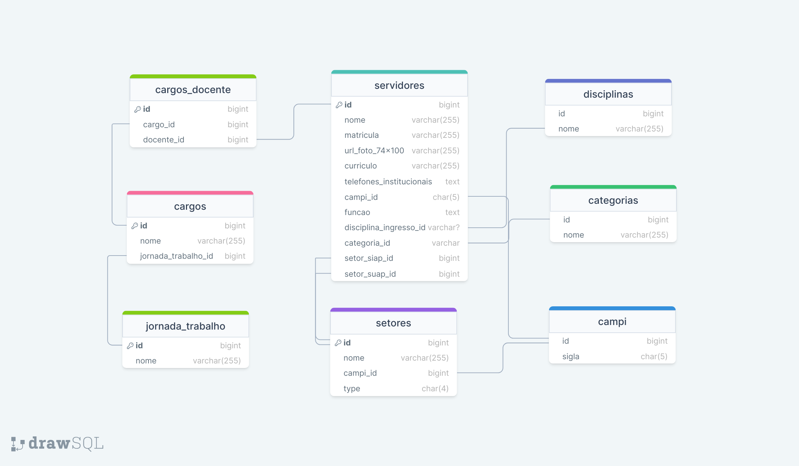

# Projeto para disciplina de banco de dados do curso de redes de computadores

## Modelo lógico


### Primeiros passos

#### Criação de ambiente virtual
```bash
$ python -m venv .venv
```
Para acessar o ambiente virtual execute:

* Linux:
    ```bash
    $ source .venv/bin/activate
    ```

* Windows:
    ```bash
    $ .venv/Scripts/Activate
    ```

Instalação das dependências
```bash
$ pip install -r requirements.txt
```

Agora crie um arquivo chamado **.env** e adicione os seguintes valores ao arquivo substituindo o que estiver entre **<>**:
```
SERVER=<IP_DO_SERVIDOR_DO_BANCO>
DATABASE=<NOME_DO_BANCO_DE_DADOS>
USERDB=<USUARIO_DO_BANCO_DE_DADOS>
PASSWD=<SENHA_DO_BANCO_DE_DADOS>
PORT=<PORTA_DO_BANCO_DE_DADOS>
```

## Acessando a pasta de código:
```bash
$ cd codigo
```

## Para rodar a aplicação execute o comando a seguir e siga as opções
```bash
$ python main.py
```

Opções disponíveis para utilização:
1. Importação de dados.
2. Relação de tipos de servidores por campi.
3. Relação de docentes por disciplina de ingresso.
4. Relação de disciplina de ingresso por campi e sua quantidade.
